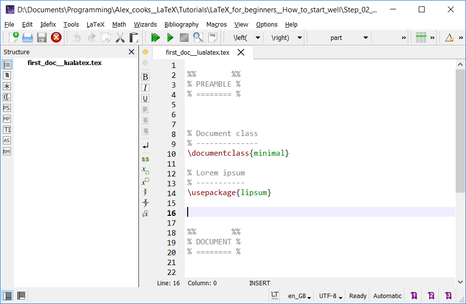
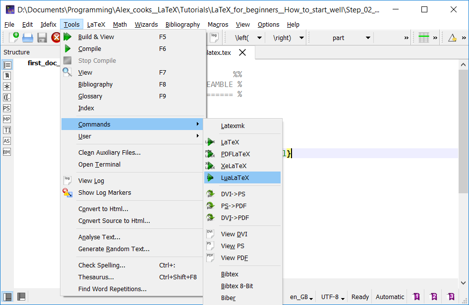
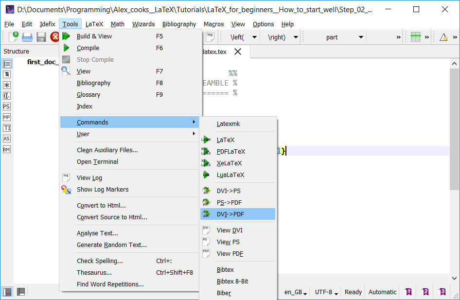
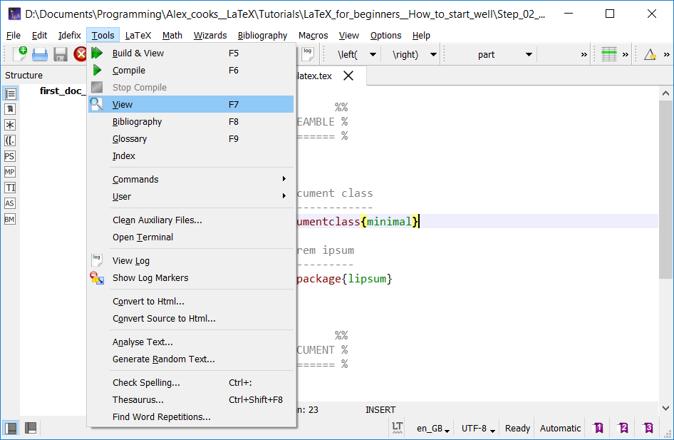

Step 2: compile LaTeX
=====================

A very short history of LaTeX
-----------------------------

To understand the reason why several compilers exist and how to choose one, 
a very short overview of the TeX/LaTeX history is presented:
1. TeX (Donald Knuth), the original work, generating DVI files;
2. LaTeX (Leslie Lamport), a layer above TeX which facilitates and standardizes
the use of TeX (packages, classes, and so on), still generating DVI files;
3. PDFTeX and PDFLaTeX (Hàn Thế Thành), which generate directly PDF files, 
allowing to embed several properties such as hyperlinks and metadata;
4. XeTeX and XeLaTeX, which improve/allow font use and characters management,
required for other languages than English;
5. LuaTeX and LuaLaTeX, which are an attempt to extend the existing TeX
with the Lua programming language.

How
----

### 1. Choose a compiler

Four modern compilers (engines):
* latex,
* pdflatex,
* xelatex,
* lualatex.

The following table summarizes the main features of all compilers.

| Features				| LaTeX		| PDFLaTeX	| XeLaTeX	| LuaLaTeX	|
| :------:				| :----:	| :------:	| :-----:	| :------:	|
| Output document type	| dvi		| pdf   	| pdf   	| pdf   	| 
| Embed properties		| x			| 	V		| 	V		| 	V 		| 
| Compiling time		| short		| short		| long		| long		|
| Fonts   				| MetaFont	| MetaFont	| OpenType	| OpenType 	|
| Images compatibility	|	eps		| png/jpg/pdf | png/jpg/pdf | png/jpg/pdf |
| Microtype	compatibility	| poor	| high		| poor		| high		|

Which one to choose?
* the LaTeX compiler should not be used anymore
  as many documents are published in a _e_-format;
* between PDFLaTeX, XeLaTeX and LuaLaTeX, a discussion is possible because
	* PDFLaTeX is more stable and the compilation is performed faster;
	* XeLaTeX is intended for modern font management
	  but has a lower integration of `microtype` (MORE TO COME about this);
	* LuaLaTeX is still under development
	  but has been claimed as the successor of PDFLaTeX.

When I need fast compilation, I'm still using PDFLaTeX.
However, I use more and more LuaLaTeX.

Anyway, once your choise is made for a specific document,
you should not change because it could affect the packages in use (crash).

### 2. Create your first document

Four **.tex** documents are available in the repository (one per compiler):
* [tex file for the latex compiler](first_doc__latex.tex)
* [tex file for the pdflatex compiler](first_doc__pdflatex.tex)
* [tex file for the xelatex compiler](first_doc__xelatex.tex)
* [tex file for the lualatex compiler](first_doc__lualatex.tex)

At the moment, all files are identical, whatever the compiler.
However, this won't be true anymore very soon,
hence the creation of different files to avoid any confusion.

#### Compile with TeXstudio

This is how you can compiler a document with TeXstudio:
1. open the document of your choice in TeXstudio,
2. click on Tools > Commands > (PDF/Xe/Lua)LaTeX,
3. let the compiler work,
4. if you compiled with latex, you need an additional step to create a PDF from the DVI file
(Tools > Commands > DVI->PDF),
5. view the PDF that has just been generated (Tools > View).

### Step completed!
